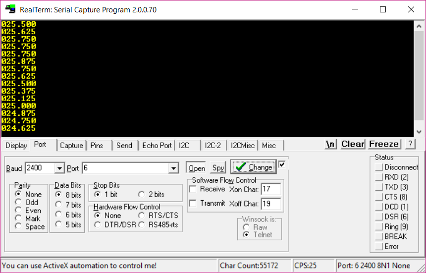
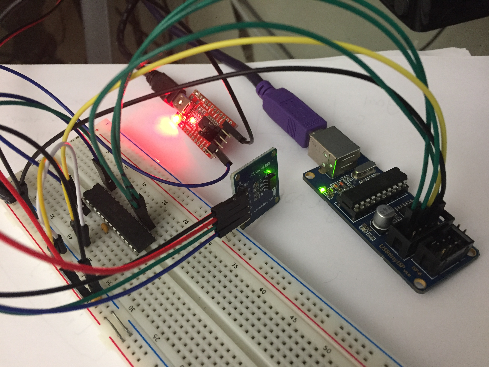
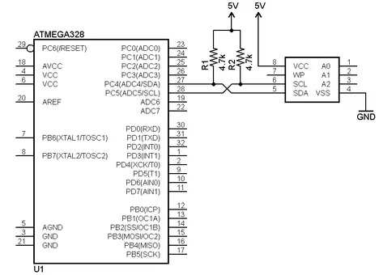

# read LM75A I2C temperature sensor with ATMega328
This was less trivial than I initially though it would be, but the final result is really clean. Just look at the contents of [main.c](main.c) to see how it works. Importantly, look at the build script (see how it includes i2c_master.c). | 

### Relevant Code
```C
uint8_t data[2]; // prepare variable to hold sensor data
uint8_t address=0x91; // this is the i2c address of the sensor
i2c_receive(address,data,2); // read and store two bytes
temperature=(data[0]*256+data[1])/32; // convert two bytes to temperature
```

### Build Command (must have -std=c99)
```bash
avr-gcc -mmcu=atmega328p -Wall -Os -o main.elf main.c i2c_master.c -w -std=c99
```
If I don't include the `-std=c99` then the following error is thrown:
> ```
i2c_master.c: In function 'i2c_transmit':
i2c_master.c:85: error: 'for' loop initial declaration used outside C99 mode
i2c_master.c: In function 'i2c_receive':
i2c_master.c:99: error: 'for' loop initial declaration used outside C99 mode
i2c_master.c: In function 'i2c_writeReg':
i2c_master.c:116: error: 'for' loop initial declaration used outside C99 mode
i2c_master.c: In function 'i2c_readReg':
i2c_master.c:134: error: 'for' loop initial declaration used outside C99 mode
avr-objcopy: 'main.elf': No such file
```

## Output



## Notes
- I tested this with my MCU running at 1MHz. It worked fine, so I didn't look closer at how to change the i2c speed.
- 
