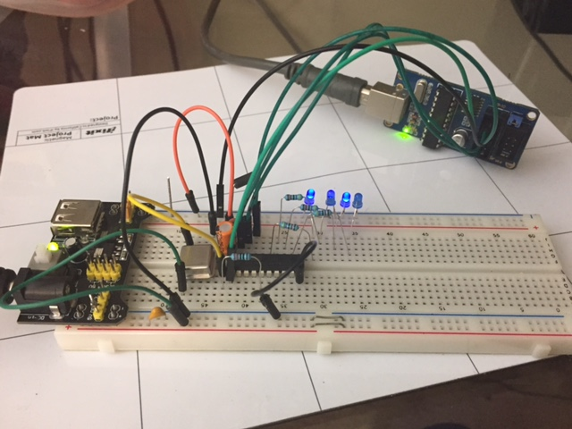

# AVR clock divider
The purpose of this project is to use an external clock source, divide it by a certain number, and output the result on chip pins. The primary goal of this project is to turn a 10MHz clock (from a canned oscillator) into 1Hz ticks.

This project makes good use of both ATTiny2313 timers. The 16-bit Timer1 is used to generate interrupts every 50,000 clock cycles (200Hz), and the 8-bit Timer0 is used to generate PWM.

Note that /DIV8 fuse has been disabled and CKOUT fuse has been enabled.

## magic pins
* PB0 - "blip" 1Hz output at 5% duty (50 ms on, 950 ms off)
* PB1 - 10Hz pulses (bit flip at 20 Hz)
* PB3 - PWM output "pulses" strong/weak once per seond. PWM is ~50kHz
* PB4 - standard 1Hz output at 50% duty (500 ms on, 500 ms off)
* PA0 - 10MHz input from can oscillator
* PD2 - CKOUT (buffered 10MHz square wave)

